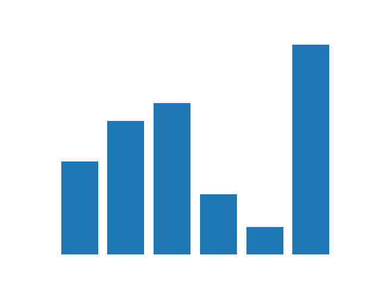
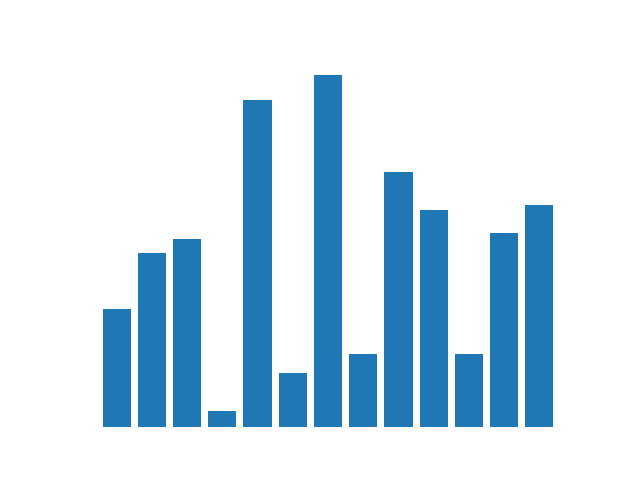

# KEEL Datasets

Most of the datasets were extracted from [KEEL repository](https://sci2s.ugr.es/keel/datasets.php). Some of them present rows with missing values (which is the data present at the column missing), All datasets are in .arff format and separated in 20 files, a train and test set for each one of the iterations of a 10-fold stratified cross validation.

## Datasets used for hyper-parameter optimization 

|name | instances | attributes | categorical | numeric | classes | missing | class distribution |
| -----: |  -----: |  -----: |  -----: |  -----: |  -----: |  -----: |  -----: |
|australian | 690 | 15 | 6 | 9 | 2 | 0.0 |  |
|bupa | 345 | 7 | 1 | 6 | 2 | 0.0 |  ||
|contraceptive | 1473 | 10 | 1 | 9 | 3 | 0.0 |  |
|flare | 1066 | 12 | 8 | 4 | 6 | 0.0 |  |
|german | 1000 | 21 | 14 | 7 | 2 | 0.0 |  |
|pima | 768 | 9 | 1 | 8 | 2 | 0.0 |  |
|vehicle | 846 | 19 | 1 | 18 | 4 | 0.0 |  |
|wisconsin | 699 | 10 | 1 | 9 | 2 | 0.02 |  |

## Datasets used for predictive performance assessment

|name | instances | attributes | categorical | numeric | classes | missing | class distribution |
| -----: |  -----: |  -----: |  -----: |  -----: |  -----: |  -----: |  -----: |
|balance-scale | 625 | 5 | 1 | 4 | 3 | 0.0 |  |
|blood-transfusion | 748 | 5 | 1 | 4 | 2 | 0.0 |  |
|credit-approval | 690 | 16 | 7 | 9 | 2 | 0.03 |  |
|diabetic | 1151 | 20 | 3 | 17 | 2 | 0.0 |  |
|hcv-egypt | 1385 | 29 | 10 | 19 | 4 | 0.0 |  |
|seismic-bumps | 2584 | 19 | 5 | 14 | 2 | 0.0 |  |
|sonar | 208 | 61 | 1 | 60 | 2 | 0.0 |  |
|turkiye | 5820 | 33 | 33 | 0 | 13 | 0.0 |  |
|waveform | 5000 | 41 | 1 | 40 | 3 | 0.0 |  |